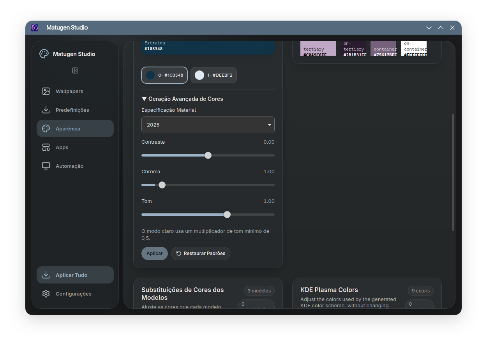

# Matugen Studio

Matugen Studio is a Tauri 2 desktop app for generating Material You palettes
from wallpapers and applying them to Linux desktop themes.

The first release focuses on KDE Plasma, with support for:

- wallpaper-driven color generation through `matugen-core`
- KDE Plasma color schemes
- GTK theme generation based on adw-gtk3
- bundled Matugen templates for supported apps
- a KDE wallpaper watch service for automatic recoloring

## Credits

Matugen Studio exists because of the work behind
[matugen](https://github.com/InioX/matugen), created by
[InioX](https://github.com/InioX). Matugen is the color generation and
templating engine that makes this project possible.

Huge thanks to InioX and everyone involved in the Matugen ecosystem. The Linux
ricing community has benefited a lot from that work, and this app is built as a
GUI-focused companion to make Matugen easier to use, especially for KDE Plasma
workflows.

Development assistance for this release was provided with OpenAI Codex.

## Build

```bash
npm ci
npm run tauri build -- --bundles appimage
```

On rolling distributions where `linuxdeploy` fails while stripping libraries,
use:

```bash
NO_STRIP=1 npm run tauri build -- --bundles appimage
```

## License

Matugen Studio is licensed under GPL-2.0-or-later. See [LICENSE](LICENSE).

Bundled third-party assets keep their original licenses. See
[THIRD_PARTY_NOTICES.md](THIRD_PARTY_NOTICES.md).

## Advanced color generation

Choose a wallpaper, then select one of its detected **Source Color** swatches.
The selected seed regenerates the palette and enabled desktop themes without
changing the wallpaper. Candidate indices come from the engine; when a new
wallpaper has fewer candidates, an unavailable index safely uses candidate 0.

Expand **Advanced Color Generation** to select Material **2025** (default) or
**2021**, and adjust Contrast (-1 to 1, default 0), Chroma (0 to 10, default 1)
and Tone (0 to 1.5, default 1). Apply commits the controls together. Reset restores
default generation settings. Chroma and Tone are HCT multipliers; Tone affects
background roles and has a 0.5 minimum in light mode. Extreme values may reduce
legibility. Both Classic and Tinted variants, Smart detection and Auto mode remain
available. 2021 with default controls reproduces the previous Material generator.

Settings live in `~/.config/matugen-studio/settings.json` (or `$XDG_CONFIG_HOME`)
and are shared with the wallpaper watcher. Presets save the selected seed,
generation controls and integrations. Older presets still load with default
values for missing fields and preserve their saved color snapshots.



## Optional KDE integrations

In **Automation → KDE Integrations**:

- **Klassy 6.5+ (major 6):** synchronize the active window outline with Material
  Primary and optionally control active titlebar opacity (0–100%). Select Klassy
  in KDE Window Decorations to see the result.
- **KDE Rounded Corners:** synchronize outline colors using Automatic (Material
  Outline), Primary, Outline or Outline Variant. The effect must be installed
  and enabled in KDE. Corner radius, shadows, geometry, thickness and opacity
  remain under KDE's controls.

Both integrations are optional and detected at runtime. Missing or unsupported
components disable their controls. Unknown effect forks are not guessed. The
first change keeps a `.matugen-backup` copy beside the relevant configuration.
Updates reload Klassy's cache/configuration or only the Rounded Corners effect;
KWin is never restarted. Turning an integration off stops future synchronization
and leaves the last applied appearance in place.

## Development

On Arch/CachyOS, install the development/runtime dependencies:

```bash
sudo pacman -S --needed base-devel rust npm webkit2gtk-4.1 libappindicator
cd ~/Projetos/Matugen-Studio
npm ci
npm run tauri dev
```

Validation without producing an AppImage:

```bash
npm run build
cd src-tauri
cargo fmt --check
cargo clippy
cargo test
cargo build
cd ../matugen-core
cargo test
```

See [the implementation audit](docs/advanced-kde-update.md) for the pinned 2025
engine adapter, migration details and validation notes.
